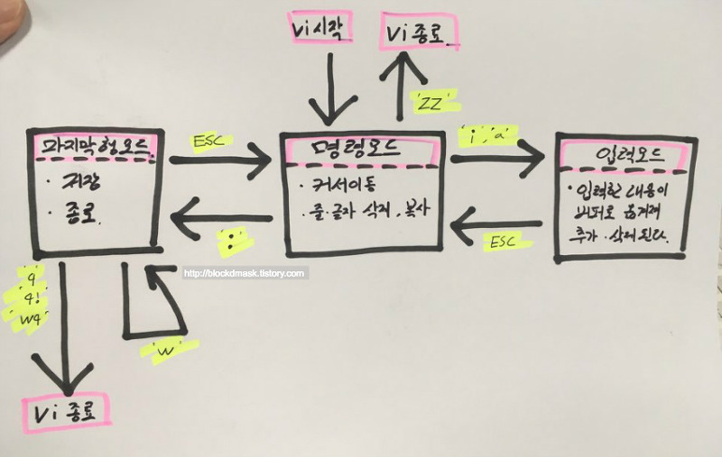

# vi editor

강제 종료  : ctrl + Z

저장 후 종료 : Esc ) ZZ



### 명령어

**명령 모드 → 편집 모드**

i  : 커서 앞에서 추가

a : 커서 뒤에 추가

A : 현재 줄의 끝에서 추가

I : 현재 줄의 앞에서 추가

o : 바로 밑 줄에 추가

O : 바로 윗 줄에 추가

**명령 모드에서**

(h,j,k,l) : (왼,위,아래,오른)

G : 맨 아래 줄로 이동

1G : 1번 째 줄 번호 이동

(ex): 1 : 1번 째 줄 번호 이동

w : 단어 이동

(삭제)

x : 하나 삭제

(3x : 현재 위치에서 3개 삭제 - 잘안씀)

dw : 단어 하나 삭제 (잘안씀)

u : (방금 삭제한거) 되돌림

dd : 한 줄 삭제 (잘라내기 - ctrl X)

D : 현재 커서부터 그 줄 끝까지 삭제

(복사)

yy : 한 줄 복사 (이름 붙여서 할 수 있음) - vi내에서만 저장

p : (paste) 붙이기

(Not vi 명령어) ctrl + Insert(Fn) : 복사 (더 유용 - 다른 윈도우 프로그램에서 사용가능 )

(Not vi 명령어) Shift + Insert(Fn) : 붙여넣기

(탐색)

/ (find 내용) : 문서 앞 부터 search

? (find 내용) : 문서 뒤 부터 search

n : 다음 내용

N : 전 내용

(편집 중 쉘 명령어 사용시)

: !(명령어) : 한 줄만 실행할 거 있으면 이거 사용

:!ls -al

:sh : 쉘 수행 - 여러 개 실행해야 하면 쉘로 잠시 빠져나가서 수행

exit으로 나오기

(유용)

J : 다음 줄과 현재 줄 연결

. : 이전 명령 재 실행

~ : 현재 커서 위치한 거 대소문자 변경

### vi setting

./.vimrc (없으면 만들기)

```bash
set nu #vi 킬 때마다 라인넘버나오게 설정
```

### practice vi

```bash
** practice vi **
# mkdir dowork
# cd dowork
# vi hello.c
# gcc hello.c //compile,link ->따로 out file명 지정X; (a.out으로 나옴)
# gcc -c hello.c //compile만 (목적파일hello.o나옴)
# gcc -o hello hello.c //link
# set //환경변수 나옴
-- PATH=/usr/local/sbin:/usr/local/bin:/usr/sbin:/usr/bin:/root/bin
# ./hello //실행
-- python의 경우
# vi hello.py
# python hello.py //실행
```
