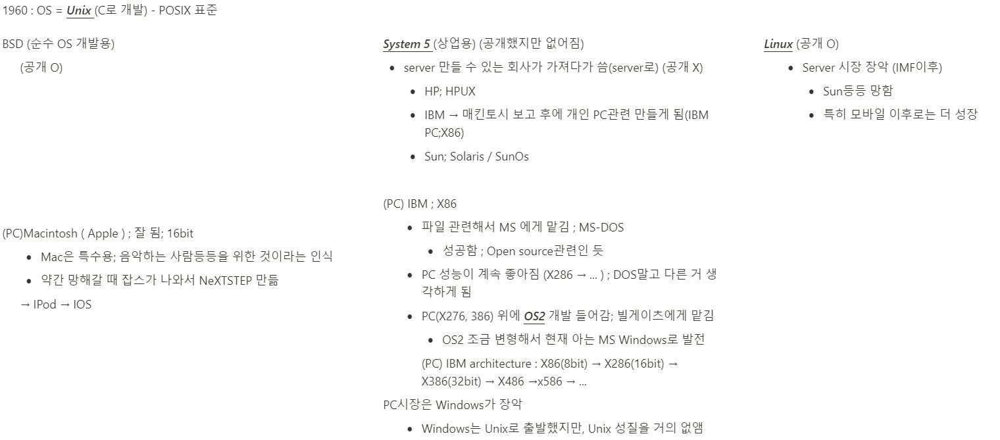
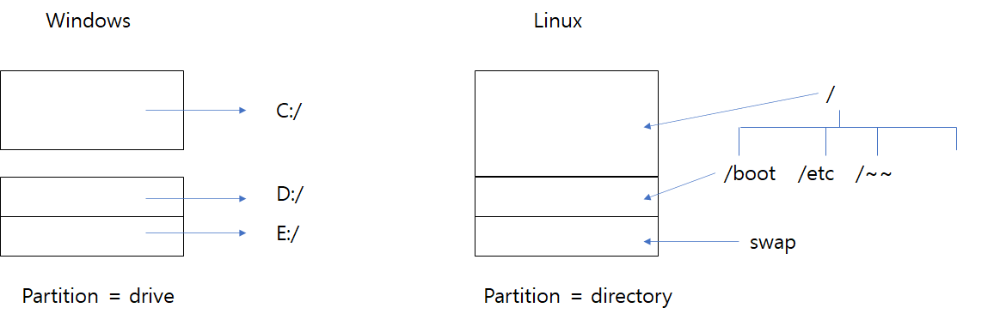

# 3. Linux

### 설치

[Java 설치](3_Linux_folder/Java_설치/readme.md)

[Tomcat 설치](3_Linux_folder/Tomcat_설치/readme.md)

[Git 설치 (2.9.5)](3_Linux_folder/Git_설치/readme.md)

[Maven 설치](3_Linux_folder/Maven_설치/readme.md)

[MariaDB 설치](3_Linux_folder/MariaDB_설치/readme.md)

### vi editor

[vi editor](3_Linux_folder/vi_editor/readme.md)

### Link
[1. Linux](#1-linux)

[2. CentOS설치 후 기본 설정](#2-centos설치-후-기본-설정)

[3. server 기본 관리](#3-server-기본-관리)

[4. Network관리](#4-network관리)

[5. 파일시스템 관리](#5-파일시스템-관리)

### History

[history text](3_Linux_folder/history_text/readme.md)




# 1. Linux

GNU 정신; (자유) 누구나 자유롭게 실행, 복사, 수정 및 배포 가능

## 1-1) 종류

Debian

- Ubuntu (desktop 기반)
- raspbian - Raspberry Pi

RedHat

- 대부분 사용 - 우리도 이거 사용
- RHEL 와 CentOS는 같이 발전함
    - RHEL - 기업에게 배포용
    - CentOS - 많이 씀
- 서버용으로 많이 사용; desktop은 약함

## 1-2) 구조

### Kernel ( = OS )

OS 중심부

- API 제공 (system call등)

### Shell

kernel 과 user 간의 interface 제공 program

shell script ;  user가 명령어를 칠 때, OS에게 그 명령을 전달해줌(system call 함)

user 창 : $

## 1-3) Linux partition



Windows : C:/Java와 D:/Java는 다른것이고 그렇게 사용해도 됨

Linux : 디스크 간에 파일명 같은게 있으면 안됨

- /boot : 512mb
- swap : 총 용량의 2배 (2048로 총용량 잡았으면, 2048 * 2 = 4096)
- 나머지 : 나머지 용량

# 2. CentOS설치 후 기본 설정

- on premiese : 직접 내가 필요한 소프트웨어 설치
    - cf) cloud : 알아서 설치되어 있음 (Paas, Saas, IaaS)

```
보안
- 소프트웨어 보안 - yum  update등으로 소프트웨어 업데이트를 통해 가능
- 네트워크 보안 - 방화벽, 트래픽 제어
- 시스템 보안 - 사용자가 어떤 명령어를 쳤는지 등등
- 어플리케이션 보안
- 암호

linux 관리자 : 소프트웨어 보안, 네트워크 보안, 시스템 보안 신경씀
application 관리자 : 어플리케이션 보안
```

### 2-1) 기본 정보

```bash
** 기본 정보 확인 **

login
# id : root
# password : 내가 설정한거

log out
# logout
# exit

system 종료 - 잘안씀
# shutdown -h now -현재 종료
# halt
# init 0

새로운 유저 추가
# useradd -g wheel webmaster
# passwd

webmaster로 계정변경
# su webmaster
root로 계정변경 ( - : root 계정 설정으로 바꿈)
# su -
어떤 계정인지 확인
# whoami

디스크 상태
# df -h
파티션 테이블
# fdisk -l

# cat fstab
# blkid

파일 상태
임의로 CD 삽입 후 마운트 및 언마운트
# ls -l /dev/cdrom
# ls -l /mnt
# mkdir /mnt/cdrom
# cd /mnt/cdrom
# mount -t ios9660 /dev/cdrom /mnt/cdrom  -마운트
# ls
# cd ~
# umount /dev/cdrom -un마운트
# cd /mnt/cdrom
# ls
```

### 2-2) 설정 및 설치

```
<설정 3가지>
1. server 시간 동기화
	/etc/cron.daily/time_sync.sh
2. history : 시간나오게 설정
	/etc/profile 내용 붙이기
3. (보안설정)원격에서 root로 바로 서버 접근 안되도록 설정
	/etc/ssh/sshd_config : PermitRootLogin no
```

```bash
1. server 시간 동기화
 -- script로 만들어서 정해진 시간에 하도록 함
# cd /etc
# ls -d cron*
# cd cron.daily
# vi time_sync.sh //sh file만들기

---- 내용 ---- (붙여넣기 : shift + Insert(fn키))
#!/bin/bash
rdate -s time.bora.net && data && clock -r && clock -w > /dev/null 2>&1
--------------

# ls -l //권한 확인
	-rw-r--r--. 1 root root   84  5월 10 15:20 time_sync.sh
# chmod 755 time_sync.sh

2. history 시간 나오도록 변경
** history : 사용한 명령어들
# history //시간이 안나옴
** history 시간나오게 변경
# ls -l profile
# vi /etc/profile
---내용---
# Security
export TMOUT=300
HISTTIMEFORMAT="%Y-%m-%d_%H:%M:%S [CMD]:"
#history
----------
grep
# grep ro /etc/profile  -profile에 ro라는 글자있는거 line별로 읽어서 있는거 출력
pipe(연결)
# ps -ef | grep sshd   - ps -ef로 읽은 것 grep로 sshd있는거 찾아보아서 출력

3. 보안 설정
# cd /etc/ssh
# vi ssh_config
# PermitRootLogin no - root로 로긴 못하게 설정해야함
# systemctl restart sshd.service
 -> 루트로 로긴 못함
# ssh root@192.168.254.40

cf ) systemctl - 많이 사용함.
# systemctl is-enabled sshd
# systemctl stop sshd  -자식 sshd가 죽음
# systemctl start sshd
```

```bash
** package 설치 및 업데이트 **
# yum repolist  - 활성화된 yum repository
# yum update  - update 할 수 있는 리스트 확인 및 업데이트

	cron : 정해진 시간에 실행하게하는 명령어 (보통 백업관련해서 시간정해서 백업할 때 씀)
	cronjob
	crontab
# yum install -y cronie

	rdate : 정확한 시간으로 설정 - 주기적으로 설정해줘야함
# yum install -y rdate

	gcc : c compiler
# yum install -y gcc
	gcc-c++ : c++ compiler
# yum install -y gcc-c++
	make - build관련
# yum install -y make
# yum install -y cmake

# yum install -y net-tools
# yum install -y bind-utils
# yum install -y psmisc
# yum install -y wget

```

### 2-3) Terminal


Dummy Terminal : server와 lan선으로 바로 연결된 터미널들 (예전 방식)

Remote Terminal : Internet으로 sshd server와 연결, 인터넷 통신이기에 보안 중요 - ssh 사용 (Secure SHell - 암호화된 쉘)

공인 IP주소

[공인 IP 주소](http://api.ipify.org/)

ARP  ; 공인망 ↔ 사설망 ; Gateway 역할도 함

# 3. server 기본 관리

root로는 못들어가게 막음; webmaster계정으로 들어가야함.

회사에서는 계정을 많이 만들지 않음. 하나의 계정으로 여러명이 들어가게 함

- 보안 = 인증 + 권한

    

    - 인증 : 사용자, 그룹
    - 권한 : 사용자

### useradd

```bash
#webmaster로 로그인

#useradd default
cd /etc/default/
useradd -D #useradd default정보 확인

#useradd
su - #root login
useradd user1
useradd -g users user2
useradd -M user3 #home directory에 안만들어짐
ls -l /home #확인해보면 user1,user2,webmaster만 있음

cat /etc/passwd #user 정보 확인
cat /etc/group #group 확인
```

### passwd

```bash
passwd user1 #user1의 비번 재설정
cat /etc/shadow #비번 암호화되어 저장되어있음
```

### userdel

```bash
userdel -r user1 #-r을 줘야 home directory에서 삭제

userdel user2
ls -l /home #확인; user2 home에 있음
cat /etc/passwd #확인; user2없음
rm -fr /home/user2 #directory삭제, rf option : 조용히 삭제
ls -l /home #삭제 후 확인은 필수
```

### group

- 보안 : 인증 + 권한
    - group은 인증대상X; password없음
    - group은 권한(CREDential) 관련된 것

```bash
groupadd group1
cat /etc/group #확인
groupdel group1

groups webmaster #webmaster가 어느 그룹에 있는 지
```

### su

```bash
#webmaster login (webmaster shell $)
ssh webmaster@192.168.254.40

#root login (root shell #)
su - #webmaster 위에 root shell뜸
su - #root 위에 root shell뜸 - don't do this
exit #shell 나오기(root shell로 감)
exit #shell 나오기(wehmaster shell로 감)

#계정 로그인정보
last
```

### directory 관리

```bash
pwd #현재 directory
ls -al #많이씀; 숨은 파일까지 전체 list
ll #alias; aka.(ls -l --color=auto)

mkdir -p dir1/subdir1 #-p : dir1,subdir1만듦
rmdir -p dir1/subdir1 #-p : dir1,subdir1둘다 지움 but dir1이 비어져있어야함, 비어져있지 않으면 p옵션없는 것처럼 실행됨
rm -r dir1 #dir1 하위 모두 지워버리고, dir1까지 지움; 보통 디렉토리 삭제시 이거 사용

cd ~webmaster #webmaster의 home directory이동
```

### file 관리

- ls -al하면 나오는 파일 정보

    ```bash
    drwxr-xr-x. 2 root root 99 5월 10 15:23 dowork
    ```

    

    

    - 실행 파일 권한 : r-x(4) , rwx(7)
    - 일반 파일 권한 : r—(4),rw-(6)
    - 디렉토리 권한 : r—(4),rwx(7), r-x(5),rw-(6) (보통 rwx,r-x많이 씀;디렉토리 밑에 실행파일이 있을 경우가 많음 - 755권한 많음)

```bash
who # 한 계정 2번 로그인
 # webmaster pts/0        2021-05-10 21:31 (192.168.254.8)
 # webmaster pts/1        2021-05-10 20:23 (192.168.254.8)

#redirection(>); 출력 데이터를 다른 장치로 보냄(한 프로세스의 입력을 파일로 보냄)
echo "Hello World" > hello.txt
echo "hello" >> hello.txt #append (Hello world에 hello추가됨)
sort < hello.txt > hello-sort.txt #hello.txt를 입력으로 받아 정렬한 후, hello-sort파일로 보냄
cat hello.txt > /dev/pts/1 #pts/0에서 하면 pts/1로 보냄
find / -user webmaster 2>/dev/null #에러내용 /dev/null로 보냄(에러가 안뜨게됨)

#pipe ; 한 프로세스의 입력 내용을 다른 프로세스 출력으로 보냄(프로세스의 통신관련)
ps -ef | grep sshd

#symbolic link
ln -s hello.txt hello
 # lrwxrwxrwx. 1 root root    9  5월 10 21:39 hello -> hello.txt
 # -rw-r--r--. 1 root root   12  5월 10 21:34 hello.txt
rm hello #symbolic link 지움
ln -s dowork/ dw
rm dw/time_sync.sh #dowork의 time_sync가 사라짐
rm dw #symbolic link dw가 사라짐

#file 권한 변경
chmod 777 hello.txt

#복사
cp test test.bak #test를 test.bak이름으로 복사
cp -R dowork dowork2 #R optiㄹon: directory 복사

#이름 변경(부모디렉토리 or 파일 이름 변경); cp rm보다 빠름
mv test test02 #rename; cp보다 빠름(복사가 아님)
mv test dowork #부모디렉토리가 ~였던 test file이 dowork가 부모디렉토리가 되도록 이름 변경됨(cp rm랑 다름)
mv -f test.backup dowork #f option : i option 무력화(강제로 물어보지 않고 실행하게 함);안 주는게 좋음

#rm ; 삭제한 것은 되돌릴 수 없음
rm -f hello.txt #강제해서 삭제함
rm -rf dowork2 #확인메세지 피해서 dowork2 디렉토리 삭제

#파일 내용 보기
cat -n hello.txt #line마다 번호와 함께 출력
cat -b hello.txt #빈 line은 세지 않고 번호와 함께 출력
more /etc/profile #enter,space로 넘기면서 볼 수 있음
less /etc/profile #vi로 켰을 때랑 비슷(editing없음)

#파일 찾기
find /etc -name pro* #이름 pro로 시작하는거 찾음
whereis profile
find /home -perm 755 #권한 755인 것 찾음

#파일 내용 찾기
grep at /etc/profile #profile에 at포함문장 찾기
ps -ef | grep sshd | grep -v grep #grep이 포함된 거는 빼고 sshd인거 찾기
grep root /var/log/secure #보완관련 위험한 로그에서 root가 포함된 내용 출력
grep -n ~~~ #line number같이 출력

#파일 권한 변경
#root로긴
touch hello.txt #root root권한
mv hello.txt /home/webmaster #root root 권한
chown webmaster:wheel /home/webmater/root.file #webmaster wheel 권한
```

```bash
#touch; file 시간정보 변경 - 현재시간으로 바꾸는 용도로 많이 사용
touch a.txt

#makefile
## makefile쓰지 않으면...매번 파일 바뀔 때마다 밑 줄 실행해야함
gcc -c main.c
gcc -c hello.c
gcc -o hello hello.c main.c
## makefile쓰게 되면...
vi makefile
#### makefile ####
hello: main.o hello.o
        gcc -o hello main.o hello.o

main.o: main.c
        gcc -c main.c

hello.o: hello.c
        gcc -c hello.c

clean:
        rm hello *.o
##################
make #파일 아무거나 바뀌고 나면 이거 실행하면 됨

# touch 쓰는 이유; 수정사항이 없는데 컴파일하고 싶을 때
touch *.c
make #수정사항없어도 다시 컴파일해줌
```

### 파일 압축 관리 ( ⭐ )

- archiving
- /dir --tar cvf--> dir.tar --gzip--> div.tar.gz
/dir <--tar xvf-- dir.tar <--gzip -d-- div.tar.gz
/dir <---------tar xvfz--------------- div.tar.gz

```bash
# /dir --tar cvf--> dir.tar --gzip--> div.tar.gz
# /dir <--tar xvf-- dir.tar <--gzip -d-- div.tar.gz
# /dir <---------tar xvfz--------------- div.tar.gz
# tar cvf : archiving
# gzip : compress
tar cvf webmaster.tar /home/webmaster #webmaster.tar
gzip webmaster.tar #webmaster.tar.gz
gzip -d webmaster.tar.gz #decompress ->webmaster.tar
```

# 4. Network관리

ping (TCP/IP가 아닌 ICMP 에 있음)

- ping이 안될 때 : ping을 일부러 막아놓기도 함
    - ping 공격 막기 위함
- ttl : 0이 되면 패킷없애는 용도
    - OS ( windows, linux, ...) 마다 초기 ttl값이 다름
        - ttl보고 OS유추 가능([blog](https://letitkang.tistory.com/53))
    - 하나 라우터 거칠 때마다 ttl값 - 1 함
        - 몇 단계 라우터를 거치는 지 ping에서는 모름
        - traceroute를 사용하면 알 수 있음
        - root계정에서 traceroute설치 후 실행해봄

```bash
ping -c 10 www.google.com
#64 bytes from nrt12s30-in-f4.1e100.net (216.58.220.100): icmp_seq=1 ttl=108 time=69.7 ms

#root 계정
yum -y install traceroute

traceroute www.google.com #30개 정도 거침
#1  192.168.254.1 (192.168.254.1)  90.899 ms * *
#...
#30 * * *

# google.com : OS ttl 138(108 + 30)정도인데 OS없음 - 할 때마다 달라져서 그런 듯(OS유추 못하게)
```

```bash
# 내 ip에 ping막고 싶을 때에는
sysctl net.ipv4.icmp_echo_ignore_all
# net.ipv4.icmp_echo_ignore_all = 0 인 것을 1로 만들어 주면 됨

vi /etc/sysctl.conf
########################추가
net.ipv4.icmp_echo_ignore_all = 1
########################
```

nslookup

```bash
nslookup www.google.com

vi /etc/resolv.conf
###################변경
#nameserver 8.8.8.8
nameserver 168.126.63.1
nameserver 168.126.63.2
###################

```

hostname

- 별칭 목록
- hostname ≠ domain name
    - host name : computer자체 이름
    - domain name : 남들이 부르는 이름
    - 보통은 둘이 일치시키는 경우가 많음
- alias처럼 별칭줄 때 사용
    - 매번 회사 DB ip를 찾게 하기 보다는 hostname에 db로 저장시킴

```bash
#hostname 변경 : localhost to lx01 (computer name이 lx01이 됨)
vi /etc/hostname
####################
#localhost.localdomain
lx01.monghead.com
####################

vi /etc/hosts #dns server에서 이름 찾기 전에 여기 먼저 뒤짐
####################
127.0.0.1   localhost localhost.localdomain localhost4 localhost4.localdomain4
127.0.0.1 lx01 lx01.monghead.com #내가 추가한 것
::1         localhost localhost.localdomain localhost6 localhost6.localdomain6
####################

ping lx01
ping lx01.monghead.com
```

```bash
# lx01.monghead.com 으로 로긴되게 만들기

#메모장 관리자 권한으로 열기
#C:\Windows\System32\drivers\etc\hosts 파일 열기
################################추가
192.168.254.40	lx01.monghead.com
################################
```

nestat

```bash
netstat -r

netstat -a | grep ssh
netstat -a | grep http
netstat -a | grep 8080

netstat -anpt | grep LISTEN #열린 TCP포트와 포트의 프로세스 출력
```

ifconfig

```bash
#랜카드 / 이더넷 카드 확인
ifconfig enp0s3
#원격에서 밑 줄 실행하면 네트워크 다운됨 - 하면 안됨
#ifconfig enp0s3 down

#본 서버 들어가서 올려야함
#ifconfig enp0s3 up
```

고정IP 설정

```bash
#vi /etc/sysconfig/network-scripts/ifcfg-enp0s3
######################집에서 할 때는 변경하기
IPADDR=192.168.254.40
NETMASK=255.255.255.0
GATEWAY=192.168.254.1
DNS1=168.126.63.1
DNS2=168.126.63.2
#######################

#vi /etc/resolv.conf
######################변경
search monghead.com
nameserver 168.126.63.1
######################

systemctl restart network
#ifconfig enp0s3 up
systemctl status network
ifconfig www.google.com
```

# 5. 파일시스템 관리

## 5-1) 파일 시스템

/ (루트) : 최상위 단 - 이 아래에 파일 만드는 것은 별로 안좋음

/home : user들 홈 디렉터리들이 밑에 존재

/root : root계정 홈 디렉터리

/etc : 설치 파일

/sbin : 시스템 관리자 위한 명령어 존재

- ifconfig, reboot, shutdown, mount,...

/bin : 일반 사용자도 실행할 수 있는 명령어들 존재

- 명령어 포함 : cat,chmod, date, ls, ...

/lib : 공유 라이브러리 (시스템 실행시 필요)

/mnt : 마운트를 위한 임시 디렉터리 위치. CD,USB 마운트시 사용

/var : log file등 수시로 업데이트 되는 파일 위치, 시스템 운영시에 필요한 파일도 존재

/proc : (process) 프로세스 및 시스템 정보(CPU,memory) 저장

- ls하면 나오는 여러 번호들 : 현재 실행중인 프로세스들

/usr

- bin,lib,include는 세트 (/usr 이나 /usr/local에 이 세 개가 함께 있음 - C 언어 기반)
    - /bin : 실행파일
    - /lib : 라이브라리
    - /include : 헤더파일

## 5-2) process

### (1) process : 자료구조로 존재

linux : C기반 - process는 task_strut 구조체로 관리됨


- 프로세스 테이블 : 커널이 관리함
    - 전체 프로세스 테이블
        - 실행 queue : queue용량에 맞게 테이블에 있는 프로세스 담고 실행시킴
    - PCB : process control block
- 가상 메모리 : disk
    - 텍스트 : 명령어들
- 컨텍스트 스위칭
    - OS에서의 context(줄거리) : process (프로그램 명령어들)
        - cf ) tomcat context? tomcat은 WAS기반, context는 어플리케이션의 정보의미
        - cf ) Spring context

### (2) status


- user mode : system call이 아닌 명령어 수행
- kernel mode : system call 명령어 수행

    ```cpp
    for(int i=0;i<10;i++){
    	int j = i+1; // user mode
    	open(file); //system call : kernel mode
    }
    ```

### (3) 관리 명령어

ps

- option 조합
    - aux : 다른 사용자 프로세스(a)와 터미널과 연결되지 않은 프로세스(x)의 자세한 정보 출력(u)
        - 터미널과 연결 안 된 프로세스
            - 명령어를 백엔드로 실행시킬 때 프로세스가 부모가 죽었을 때 원래 자식이 죽어야 함 근데 해보면 systemd 부모로 변경되는 듯

            ```bash
            #백엔드에서 실행(엔터치면 쉘 실행가능)
            tail -f /etc/profile &

            #확인
            ps -ef | grep tail
            # root     11571  7526  0 18:30 pts/0    00:00:00 tail -f /etc/profile

            pstree
            #systemd─┬─NetworkManager───2*[{NetworkManager}]
            #        ├─sshd───sshd───sshd───bash───su───bash─┬─pstree
            #                                                └─3*[tail]

            #터미널 꺼버린 후 확인 : 부모가 아닌 다른 프로세스로 들어가는 듯
            pstree
            #systemd─┬─NetworkManager───2*[{NetworkManager}]
            #        ├─sshd───sshd───sshd───bash───su───bash───pstree
            #        ├─3*[tail]

            #참고 : 프로세스 죽일 때
            kill (PID)
            ```

    - ef : 많이 사용 - 모든 프로세스(e)의 자세한 정보 보여줌(f)
        - 자세한 정보 : UID, PID,PPID,TTY(연결된 터미널),TIME(총 실행시간),C(CPU사용량), CMD(command-명령)
        - grep이랑 함께 사용하여 현재 돌아가고 있는 프로그램 정보를 알 수 있음

pstree

- process 정보를 트리형태로 보여줌

top

- 실시간 모니터링 of process CPU,memory 사용량
- load : 실행 큐와 프로세스 테이블 관련
    - 실행 큐의 용량은 한정적이고, 프로세스 테이블에 있는 프로세스들을 모두 실행 큐에 담을 수 없음. 실행 큐에 못담은 프로세스들은 대기해야함
- load average : 현재 시스템이 얼마나 일을 하는 지
- interrupt

kill

- process에게 signal 보냄
- kill -9 (PID) : 해당 PID 프로세스 죽임

free

- 시스템 메모리 정보 출력
- 사용가능한 메모리 확인 가능
    - available + (buff/cache 중 일부)
    - buff/cache : pool (IO관련해서 일시적으로 할당해놓는거) buff 줄이면 IO속도가 느려질 수는 있음
