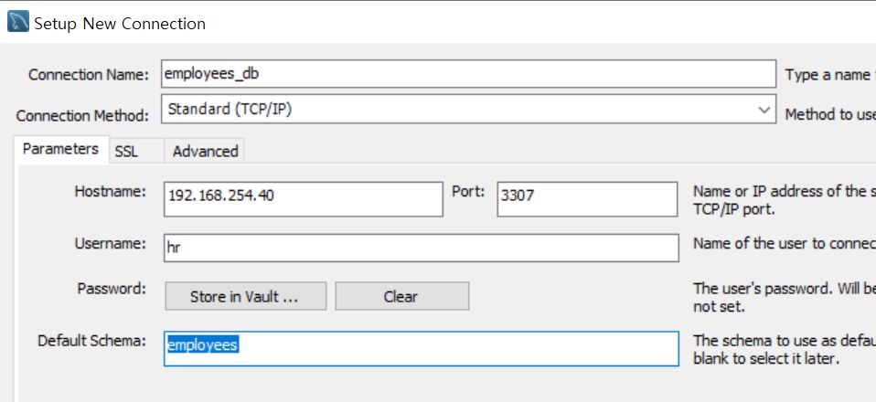
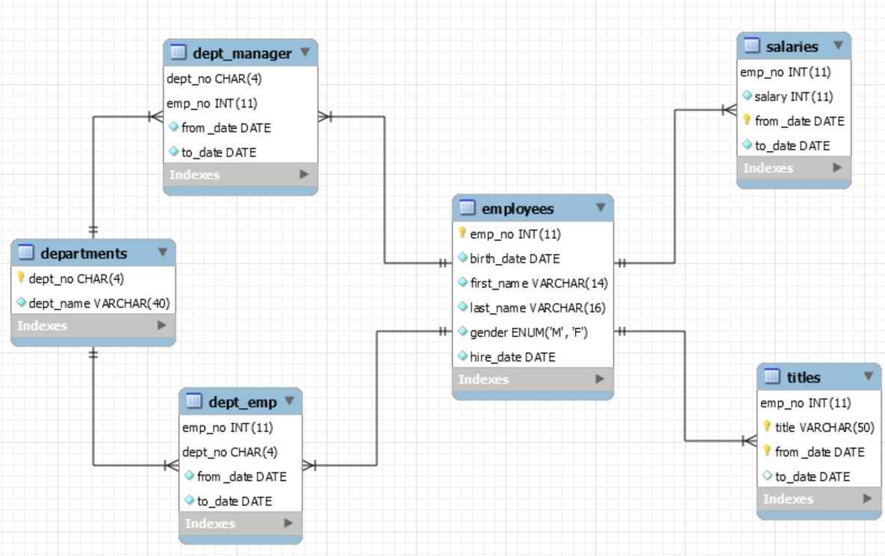
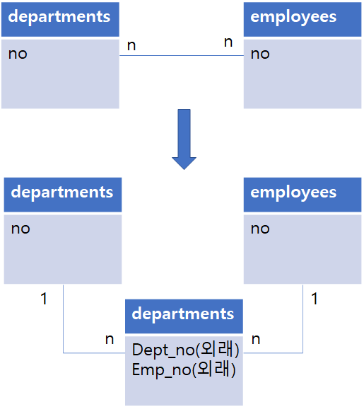

# Server & Client 기본 설정

## 1. linux: mariadb

### (0) 접속

- 리눅스 사용자와 db사용자랑 헷갈리지 말기.
    - 리눅스 root로 접근해도 db사용자는 처음에 webmaster로 접속될 수 있고, 물론 root로 접속할 수도 있음

        ```bash
        # linux root계정에서 mariadb 접속하기
        mysql -u webmaster -p #mariadb:webmaster계정
        mysql -u root -p  #mariadb : root계정
        mysql -p #linux와 동일한 계정으로 로그인 (root로)
        ```

    - 사용해보기

        ```sql
        select version(); --대소문자 구분하지 않음
        select current_date;
        select now() as '현재 시간'; --alias

        select
        naw() --잘못 입력함
        /c --cancel

        ```

### (1) DB 생성

```sql
show databases;
drop database test;
create database webdb;
use webdb; --db사용
--mysql -u root -D webdb -p; --리눅스에서는 이렇게 접속 가능
```

### (2) 인증(Authentication);사용자,비번 생성

```sql
--DBA권한으로 접속
mysql -u root -D mysql -p
--1 : linux(local 접속) : password - webdb
create user 'webdb'@'localhost' identified by 'webdb';
--2 : client 접속(현재 컴퓨터 주소)
create user 'webdb'@'192.168.%' identified by 'webdb'; --특정X 전체 접속가능
create user 'webdb'@'192.168.254.8' identified by 'webdb'; --교육장에서 접속가능
```

### (3) 권한 부여 (Authorization)

```sql
--webdb 모든 테이블에 대한 권한을 방금 만든 유저에게 줌
--1
grant all privileges on webdb.* to 'webdb'@'localhost';
--2
grant all privileges on webdb.* to 'webdb'@'192.168.254.8';
grant all privileges on webdb.* to 'webdb'@'192.168.%';
```

### (4) 새 변경사항 적용

```sql
flush privileges;
```

### (5) test

```sql
exit
mysql -u webdb -D webdb -p --비번은 webdb
```

## 2. client : workbench

- 실행 : ctrl + enter

데이터 불러오기

```sql
--xshell에서 pet.txt가 있는 폴더로 이동 후 밑 실행
sftp webmaster@192.168.254.40
put --pet.txt선택
exit
ssh webmaster@192.168.254.40
mysql -u webdb -D webdb -p
load data local infile '/home/webmaster/pet.txt' into table pet;
```

## 3. DB 백업

### 1) 빈 DB 생성

- db name : employees
- db user : hr
- db user password : hr

```sql
mysql -p
create database employees;
create user 'hr'@'localhost' identified by 'hr';
grant all privileges on employees.* to 'hr'@'localhost';
flush privileges;
exit

mysql -u hr -D employees -p
```

### 2) 백업 가지고 오기

```python
# 윈도우에 있는 zip file 가지고 오기
cd E:\배경화면\STUDY\DOUZONE\03.자료\MySQL
dir #확인
sftp 'webmaster'@'192.168.254.40';
put employees_db.zip;
dir #업로드 된건지 확인
exit
ssh 'webmaster'@'192.168.254.40';
su - #root 계정에 옮겨놓을라고
mv /home/webmaster/employees_db.zip .

# zip,unzip 없는 경우 설치
yum install zip -y
yum install unzip -y

unzip employees_db.zip

cd employees_db
# employees_db내의 employees.sql을 employees에 넣기
mysql -u hr -D employees -p < employees.sql
```

### 3) window client에서 접근가능하도록 하기

```sql
# window client에서 접근시에 DBA 권한으로 접근
# DBA 접근되도록 root에 user 만듦
# window(내 컴퓨터)IP가 접근할 수 있도록 계정 만듦

mysql -p
create user 'hr'@'192.168.254.8' identified by 'hr';
grant all privileges on employees.* to 'hr'@'192.168.254.8';
flush privileges;
```

### 4) window client 생성



리눅스 IP 적기

### 5) ERD

- 비즈니스 분석 및 데이터 설계도 한 눈에 볼 수 있음
- workbench : databases - reverse engineering - 연결하기



- employees : salaries or titles = 1:n
    - 사원이 연봉이 변하는 것 모두 저장(기간마다 저장)
    - titles : 직책; 사원 하나당 기간당 직책 저장
- departments와 employees는 기본적으로 다대다 관계
    - 중간 테이블 생성 : 중간에 dept_emp 라는 테이블을 놔두게 됨

        
