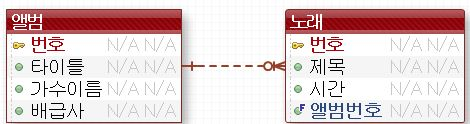

# 4. RDBMS

## 목차

[1. RDB 개요](#1-rdb-개요)

[2. SQL](#2-sql)

[3. Database Design](#3-database-modeling)

[4. DB Programming(JDBC)](#4-DB-programming)

---

### 환경

- linux(centOS) mariadb 사용

---

### code

- [SQL and JDBC practices](https://github.com/mong-head/mariadb_practices)

---

### DB 배우는 것

1. Relation DB design

    → DA, DB schema (데이터 설계); entity (ERD;Entity Relational Diagram)

    → make table(Physical)

2. SQL ; Structure Query Language
    - 종류 : DDL, DCL, DML
        1. DDL : DA가 사용 - 설계하는 사람
        2. DCL : Control language - DBA가 사용 - 데이터 접근관련
        3. DML : DB develper가 사용 (데이터 다루는 사람들이 사용) (Create Read Update Delete) - 우리가 할 것
3. DB programming
    - (c, c++, java(JDBC-interface모음) ,python, JavaScript, PHP,...)

        ```bash
        # JDBC programming

        # interface : Connect, Statement, ResultSet

        # Connect는 우리가 신경안써도 되는 부분
        #Connect C = new OracleConnect()
        Connect C = DriverManagement.getConnect()

        # Statement, ResultSet등등의 부분은 우리가 하는 부분
        Statement S = C.creatStatement()
        S.excuteQuery("qeury문")

        ResultSet RS
        ```

---

# 1. RDB 개요

## 1-1. DB 정의

데이터의 집합

- 데이터를 연관시키고 조직화 및 공유되어야 함
    - 공유 : 여러 사람이 동일한 데이터에 접근 및 이용 가능
- 효율적으로 실시간으로 저장, 검색, 갱신 가능해야함


## 1-2. DBMS

### (1) 특징

- 데이터 중복 최소화시킴
- 일관성 및 무결성 유지하게 해줌 (에러내거나 확인 문구 보냄)
- 보안 보장
- 백업 및 복구 복잡함
- 부분적인 DB손실 → 전체 시스템 정지시킴
- 보통 DB 30만 개 ~ 100만 개 존재

### (2) 종류

1. 관계형 DB (RDB)
    - 정확함 (무결성, 조직화)
    - 빠르지는 않음
    - 쿼리로 데이터 분석
2. 객체형 관계형 DB (ORDB)
    - 정보를 객체로 표현
    - 잠깐 쓰였다가 잘 안쓰이게 됨
    - PostgreSQL
3. NoSQL
    - 대량으로 처리하는 데에 특화됨
    - big data처리 관련 DB
    - MongoDB
        - JSON방식으로 데이터 저장

## 1-3. RDB


(왼) 논리 데이터 모델링 (오) 물리적 DB

### (1) ERD


1:1 : 하나가 다른 하나의 속성일 경우가 많음

1:n : n인 부분에 1인 것이 외래키로 들어가 있음

n:n

## 1-4. MariaDB (RDBMS)

MySQL기반으로 탄생 (MySQL이 Oracle로 합병된 후 탄생)

- MySQL과 거의 유사함(호환됨)
- optimizer는 MySQL보다 MariaDB가 더 좋음

### client program


- 리눅스 서버 로컬에서 접근계정과 클라이언트로 접근하는 계정 2개에 대한 접근 설정해야함.

- [Server & Client 기본 설정](4_rdbms_folder/Server_Client_folder/readme.md)

# 2. SQL

### 종류

1. DML
    - 데이터 조작어
        - select (검색)
            - 기본
            - 집계
            - join
            - subquery
        - insert, update, delete
            - transaction개념
2. DCL
    - 사용자 만들고 할 때 사용함
3. DML

## 2-1. DML

### (1) 기본  및 집계 ([code](https://github.com/mong-head/mariadb_practices/blob/master/src/site/employees/01_basic_select.sql))

- query 실행 순서
    1. from : 접근 테이블 확인
    2. where : 조건에 맞는 row 선택 -> 임시테이블, 집계 전임. 따라서 집계를 where절에서 쓰면 오류남
    3. 집계
    4. having : where절에서는 못 본 집계 처리 가능
    5. projection
- 임시 테이블 생성
    - 전체 테이블 (from으로 읽음)
    - → where로 뽑은 임시 테이블1
    - → 집계처리한 임시 테이블2
    - → having으로 뽑은 집계 결과 임시 테이블3
    - → order by 임시 테이블 4
    - → projection : 결과 테이블

```sql
select
from
where -- 집계 불가능
group by -- 통계관련
having -- 통계관련; 집계 처리 가능
order by -- 시간 걸림, 정렬 위한 임시 테이블 만듦
```

### (2) 함수 (링크)

- 문자열 함수
    - 문자열 처리는 java에서 하는 것보다는 query에서 하는 것이 성능면에서 더 좋음
- 숫자 함수
- 날짜 함수
- 집계 함수

### (3) JOIN

PK, FK 값의 연관 (1 : n 관계)

- cartesian join
    - takes bunch of time and memory

        ```bash
        #catesian join 후 메모리 현황 보려면?
        df -h # server memory 현황 알 수 있음
        ```

    - join에 대한 조건이 없는 경우 두 테이블 cartesian product 구함
    - 각 테이블마다 모든 행들끼리 join 됨
    - n * m ( n : table 1 행 크기, m : table2 행 크기)

        ```sql
        select *
        from table1, table2
        ```

- inner join
    - 두 테이블 모두 조건 만족할 때
    - 종류
        - equijoin → where 절에 같다는 조건 두는 것

            ```sql
            select *
            from table1,table2
            where table1.column1 = table2.column2;
            ```

        - join on (standard)
            - equijoin과 성능차이는 없음

            ```sql
            select *
            from table1 join table2
            on table1.column1 = table2.column2;
            ```

        - natural join
            - 잘 안쓰임.
            - 조건에 들어갈 칼럼이름이 두 테이블 간 동일하면 알아서 on을 넣어줌
            - 일반적으로 칼럼 이름이 동일하지 않은 것 같음 그래서 잘 안쓰이는 듯
            - 또한 결과가 위험할 수 있음
        - join ~ using
            - 역시 잘 안쓰임
            - 같은 칼럼이름인 경우는 흔하지 않아서 그럼

                ```sql
                select *
                from table1
                join table2 using (column_)
                ```

- outer join
    - null 도 나오게; 조건 만족하지 않아도 나오게
    - 종류
        - left join
        - right join

### (4) subquery

java에서 여러 쿼리문(개별의 select를 여러개)을 사용하기 보다 하나의 결과값을 위한 것이라면 subquery를 사용해 한 문장의 sql문으로 만드는 것이 좋다.

# 3. Database modeling

- 중복성 제거 위함
- 정규화(normalization; 데이터 설계시 원칙) 1~5단계
- modeling tool
    - eXERD 사용
- example : 음원 검색 데이터베이스 설계?

    

## 3-1. Data model

### 1) 3가지 요소

- entity : 사물, 물체
- attribute (속성) : entity 정보 저장
- relation : entity 정보 저장

### 2) 데이터 설계?

- 너무 많이 생각하지 말고 일단 모국어로 시작하기
    - example 1단계 설계

        

- 방법
    1. entitiy 생각
    2. entity간의 relation 생각
    3. entity의 attribute 생각
    4. entity 의 PK 생각
    5. 정규화

## 3-2. Normalization

- 중복성 제거
- update anomalies(갱신 이상) 회피

### 1) 제 1 정규화

- 모든 속성 값이 하나의 값을 가져야 1NF
    - example
        - 노래의 경우, 하나의 값만 가지지 않게 됨. 한 가수의 여러 노래가 들어가게 됨 - 1NF 위배
        - "앨범"에 노래가 있게 되는 경우, 즉, 하나의 칼럼에 하나의 노래가 들어갈 경우 다른 칼럼들(가수이름,타이틀등)의 중복이 발생
        - "노래"칼럼이 빠져야 함 → 다른 테이블로 나옴과 동시에 "relation"이 필요하게 됨

            

- 유일한 식별자
    - 모든 테이블은 식별가능한 유일하고 null이 아닌 Primary Key를 가져야 함.
    - 비즈니스와 상관없는 값을 가져야 함.
    - 인위적으로 만드는 것이 좋음
        - example : PK 가지도록

            

- relation
    - 1 : 1 인지, 1 : N 인지 N : M 인지
        - 1 : N 이 흔함
        - N : M → 1 : N 으로 변경해야함 ( by creating intermediate table)
            - 중간 테이블은 비즈니스에 없기에 이것을 사용하는 것보다 비즈니스와 관련있는 테이블을 대신 사용하는 것이 더 좋음
    - 식별관계
        - 특별한 경우 사용
        - FK가 주 키; 식별키(PK)로 사용될 때
        - 보통은 각 테이블마다 PK가 인위적으로 만들어져 있기에 이 관계는 많지 않다.
        - 중간테이블 만들 때 이 경우가 많은 듯
    - 비식별관계
        - 많음
        - FK는 그냥 FK; 일반 칼럼으로 사용될 때

            

            - example

                

### 2) 제 2 정규화

- PK가 아닌 칼럼들이 PK에 종속적이지 않은 경우 2NF 위반
    - example
        - 가수와 배급사는 "앨범"에 종속적이지 않음
            - 하나의 앨범에 아이유가 있고, 다른 앨범에도 아이유가 있을 수 있다.

                

            - 정규화와 관계없이 N : M 관계는 1 : N 으로 만들어야 함
                - 중간 테이블을 임의로 만든 경우 ( 비즈니스 X )

                    

                - 가수_앨범을 대신할 수 있는 테이블 존재 : "노래" 테이블 ( 비즈니스 O - good)

                    

### 3) 제 3 정규형

- 한 entity내의 어떠한 칼럼이 PK에 종속적인 것이 아닌 식별키가 아닌 키에 종속적인 경우
- 잘 따지지는 않음
    - example
        - "노래"에 "장르"를 넣고 싶어 넣게 됨. "장르 약어"도 함께 넣고 싶어짐

            

            - "장르 약어"의 경우 "노래"에 종속적인 것이 아닌 "장르"에 종속적임.
        - 노래 와 장르는 N : M 관계 - 중간테이블 생성

            

## 3-3. Denormalization

- 성능면에서 정규화한 것을 다시 역정규화하는 경우가 있음
- 보통 제 3 정규화를 역정규화하는 것이 많음
- 반드시 정규화를 하고 난 뒤 역정규화를 해야함
    - 정규화 과정을 거치면서 비즈니스를 명확히 하는 과정을 거쳐야 함

## 3-4. 물리 DB 설계

- linux server : cdmall DB만들기
    - user : localhost, my computer ip 생성 및 권한 부여
- modeling tool → foward engineering
    - jdbc driver 위치 : 'C:\Users\'user name'\.m2\repository\org\mariadb\jdbc\mariadb-java-client\2.7.2\'

    

    

과제 : 온라인 쇼핑몰 데이터 아키텍쳐 설계

# 4. DB programming

## JDBC (JAVA Database Connectivity)

- java program이랑 DB랑 중간 이음 역할
- 자바 프로그램 내에서 sql 실행위한 자바 API
- 자바 이용한 DB 접속 및 SQL실행, 실행 결과로 얻어진 data handling 제공방법과 절차 규약
- SQL - programming language 통합 접근
- 원하는 DB에 연결


- JDBC API : 여러 interface 존재
    - connect(), statement(), ResultSet()
- 각각의 DB에서 해당 interface 구현(class)

### 1) JDBC 코드 짜기

- 순서
    1. driver loading
    2. Connection 객체 생성
    3. Statement 객체 생성
    4. (select) ResultSet 객체 생성
    5. 모든 객체 닫기

- pom.xml : driver loading위함

```xml
<dependencies>
  	<!--  MariaDB JDBC Driver -->
		<!-- https://mvnrepository.com/artifact/org.mariadb.jdbc/mariadb-java-client -->
	<dependency>
    	<groupId>org.mariadb.jdbc</groupId>
    	<artifactId>mariadb-java-client</artifactId>
    	<version>2.7.2</version>
	</dependency>  
 </dependencies>
```

(1) 완결된 sql문인 경우 - 사용X

- select

    ```java
    // 자원
    Connection conn = null;
    Statement stmt = null;
    ResultSet rs = null;

    // 1. JDBC driver loading
    Class.forName("org.mariadb.jdbc.Driver");

    // 2. DriverManager - get connection
    String url = "jdbc:mysql://192.168.254.40:3307/employees?chareset=utf8"; //linux server ip
    conn = DriverManager.getConnection(url,"hr","hr");
    conn.createStatement();
    System.out.println("success connection");

    // 3. Statement 생성 - query 실행위함
    stmt = conn.createStatement();

    // 4. SQL실행
    String sql = "select emp_no,date_format(birth_date,'%Y-%m-%d'),first_name from employees where first_name like 'pat%'";
    rs = stmt.executeQuery(sql);

    // 5. result 가져오기
    while(rs.next() /*각각의 행 가지고 오기*/) {
    // type 잘 맞춰서 적어야함
    		long empNo = rs.getLong(1);
    		String birthDate = rs.getString(2); //date는 string으로 받으면 됨
    		String firstname = rs.getString(3);

    		System.out.println("emp num : "+empNo+" ,birth : "+birthDate+", first name : "+firstname);
    }
    ```

- update, delete, insert

    ```java
    Connection conn = null;
    Statement stmt = null;
    boolean result = false;

    // 1~3은 위와 동일

    // 4. SQL실행
    String sql = "insert into dept values(null,'"+ name +"');";
    int count = stmt.executeUpdate(sql);

    result = count == 1;
    ```

(2) 완결되지 않은 sql문 : binding( sql + value )

- ex ) "select * from table1 where no = ?"
- select

    ```java
    //1,2는 동일
    // 3. prepare sql statement : "?"
    String sql = "select emp_no, first_name,last_name,date_format(hire_date,'%Y-%m-%d')"
    					+ " from employees"
    					+ " where first_name like ? "
    					+ " and last_name like ?";
    pstmt = conn.prepareStatement(sql);

    // 4. binding
    pstmt.setString(1, "%"+name+"%");
    pstmt.setString(2, "%"+name+"%");

    // 5. SQL실행 : executeQuery(sql)이 아님
    rs = pstmt.executeQuery();

    // 6. result 가져오기
    while(rs.next() /*각각의 행 가지고 오기*/) {
    // type 잘 맞춰서 적어야함
    	long empNo = rs.getLong(1);
    	String firstname = rs.getString(2);
    	String lastname = rs.getString(3);
    	String birthDate = rs.getString(4); //date는 string으로 받으면 됨

    	EmployeeVo vo = new EmployeeVo();
    	vo.setEmpNo(empNo);
    	vo.setFirstName(firstname);
    	vo.setLastName(lastname);
    	vo.setBirthDate(birthDate);
    	vo.setFullName(firstname+" "+lastname);

    	System.out.println("emp num : "+vo.getEmpNo()+" ,birth : "+vo.getBirthDate()+", first name : "+vo.getFirstName());
    }
    ```

- update, delete, insert

    ```java
    // 3. Statement 생성 - query 실행위함
    String sql = "update dept set name = ? where no = ?";

    // 4. prepare statement
    pstmt = conn.prepareStatement(sql);

    // 5. binding
    pstmt.setString(1,vo.getName());
    pstmt.setLong(2,vo.getNo());

    // 6. SQL실행
    int count = pstmt.executeUpdate();		
    result = count == 1;
    ```

- DAO


